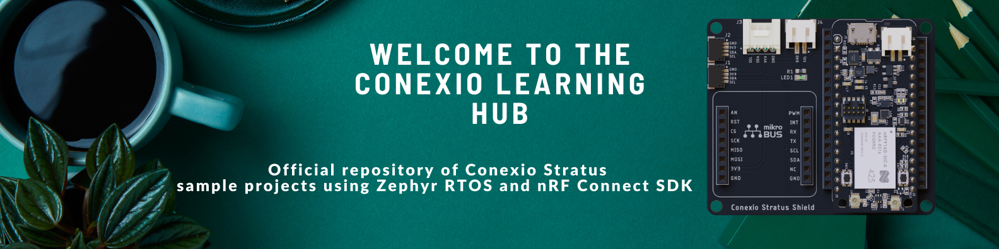
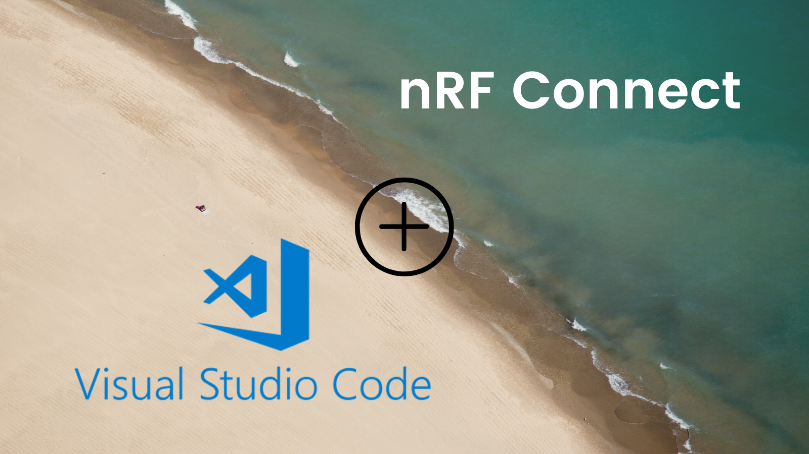
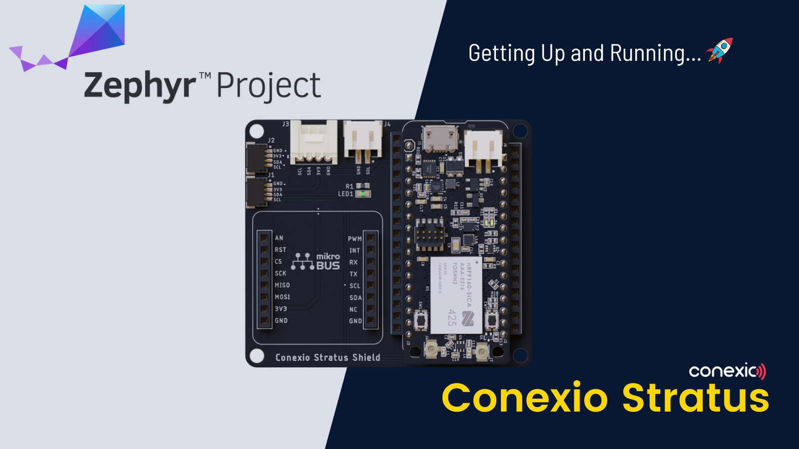
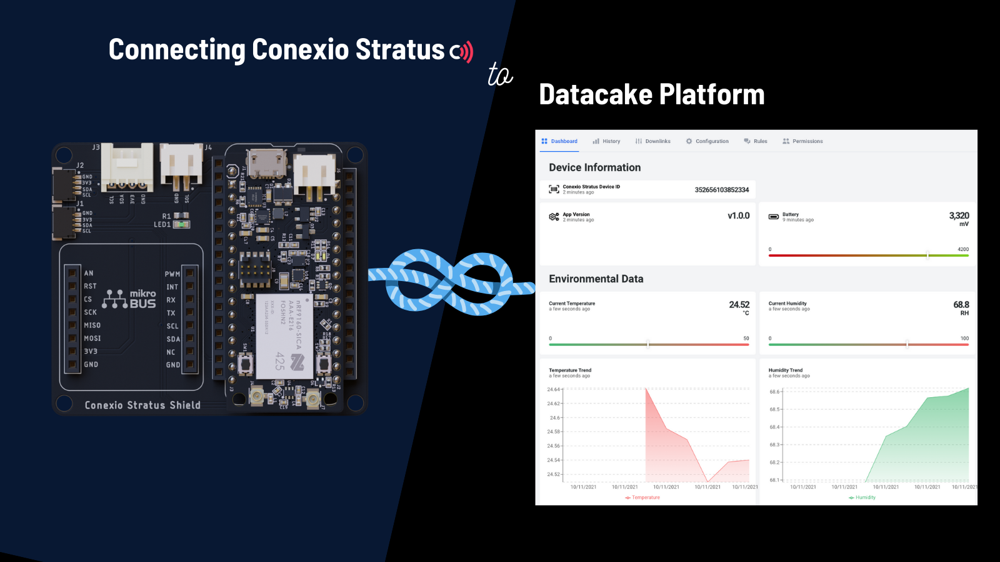
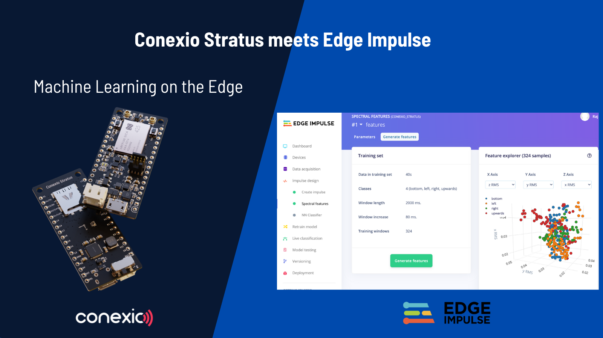
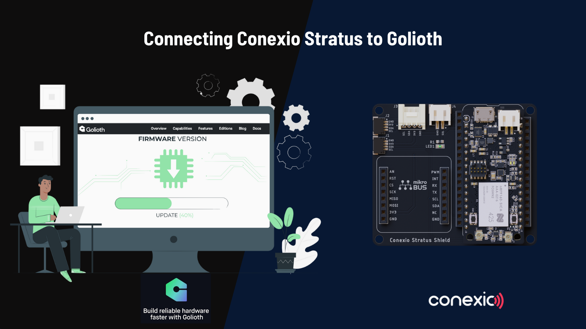

Here you will find all the Conexio Stratus application examples and associated files to get started with creating and building your first application.
The current sample applications are compatible for nRF Connect SDK (NCS) v1.7.0. 

🖱 Click on any of the projects below to go to the full walk-through tutorial or Hackster projects and learn how to build and execute them on your Stratus device.

<table>    
    <tr>
        <td>
             
            Getting Started with nRF Connect for Visual Studio Code  
            <a href="https://www.rajeevpiyare.com/posts/nrfconnect-vs-code/">Blog</a> | <a href="https://www.hackster.io/piyareraj/getting-started-with-nrf-connect-for-visual-studio-code-24c882">Hackster</a> | <a href="samples/led_blink/">Source Code</a>
        </td>  
        <td>
             
            Up and Running with ZephyrRTOS on Conexio Stratus Platform  
            <a href="https://www.rajeevpiyare.com/posts/stratus-getting-started/">Blog</a> | <a href="https://www.hackster.io/piyareraj/up-and-running-with-zephyrrtos-on-conexio-stratus-iot-kit-4661a3">Hackster</a> | <a href="samples/led_blink/">Source Code</a>
        </td>        
        <td>
             
            Connecting Conexio Stratus to Datacake Platform  
            <a href="https://www.rajeevpiyare.com/posts/stratus-to-datacake/">Blog</a> | <a href="https://www.hackster.io/piyareraj/how-to-connect-and-visualize-iot-data-using-datacake-cloud-2f6681">Hackster</a> | <a href="samples/datacake/">Source Code</a>
        </td>       
    </tr>
    <tr>
        <td>
             
            Machine Learning with Conexio Stratus and Edge Impulse  
            <a href="https://www.rajeevpiyare.com/posts/edge-impulse/">Blog</a> | <a href="https://www.hackster.io/piyareraj/machine-learning-with-conexio-stratus-and-edge-impulse-25ad20">Hackster</a> | <a href="samples/edge_impulse/">Source Code</a>
        </td>        
        <td>
             
            Connecting Conexio Stratus to Golioth  
            <a href="https://www.rajeevpiyare.com/posts/stratus-to-golioth/">Blog</a> | <a href="https://www.hackster.io/piyareraj/connecting-conexio-stratus-to-golioth-platform-e15cd9">Hackster</a> | <a href="samples/golioth/">Source Code</a>
        </td>
        <td>
             
            Device Debugging and Monitoring using Memfault  
            <a href="https://www.rajeevpiyare.com/posts/stratus-to-memfault/">Blog</a> | <a href="https://www.hackster.io/piyareraj/remote-device-debugging-and-monitoring-using-memfault-093aee">Hackster</a> | <a href="samples/memfault/">Source Code</a>
        </td>        
    </tr>
</table>

### [📚 Dive into the docs here →] [Getting Started](https://docs.conexiotech.com/)

## Stratus Sample Applications Roadmap

This repository is still under development and we have many example applications on the way! These applications will cover a majority of features we plan to support for the Conexio Stratus kit. For reference, here's our tentative roadmap to version 1.0:

| Feature                                        | Status |
| -----------------------------------------------| ------ |
| User LEDs									     | ✅ | 
| LIS2DH accelerometer based motion sensing      | ✅ | 
| SHT4x temperature & humidity sensing           | ✅ |
| Battery monitoring                             | ✅ |
| DPS310 temperature & pressure sensing          | ✅ |
| Seeedstudio groove buzzer            			 | ✅ |
| BME280 environmental sensor                    | ✅ |
| AT client                    					 | ✅ |
| nRF cloud client     							 | ✅ |
| Datacake cloud client  						 | ✅ |
| Edge Impulse machine learning    				 | ✅ |
| Golioth firmware over-the-air update  		 | ✅ |
| Golioth cloud client                         	 | ✅ |
| Memfault cloud client            				 | ✅ |
| Watchdog timer            					 | ✅ |
| TeraBee level sensing                    		 | ✅ |
| GPS                    						 | ✅ |
| Cellular based location                        | ⏳ |
| Asset tracking                         	     | ⏳ |
| Qubitro cloud client             				 | ⏳ |

- ✅ = Ready to use
- ⏺ = Partial support
- ⏳ = In progress
- ❌ = Not started (but on roadmap)

## Community

Got Questions? Post it on our [discussions forum](https://github.com/Conexiotechnologies/conexio-stratus-firmware/discussions) or join the conversation in our [Discord channel](https://discord.gg/2CZJTrt6Z5).

## Have an idea? Notice a bug?

We'd love to hear your feedback! Feel free to log an issue on our GitHub issues page. If your question is more personal, our Twitter DMs are always open as well or info@conexiotech.com.

## Licensing
Licensing is very important to open source projects. It helps ensure the software continues to be available under the terms that the author desired.

Our firmware uses the Apache 2.0 license (as found in the LICENSE file in the project’s GitHub repo) to strike a balance between open contribution and allowing you to use the software however you would like to. 
The Apache 2.0 license is a permissive open source license that allows you to freely use, modify, distribute and sell your own products that include Apache 2.0 licensed software. 