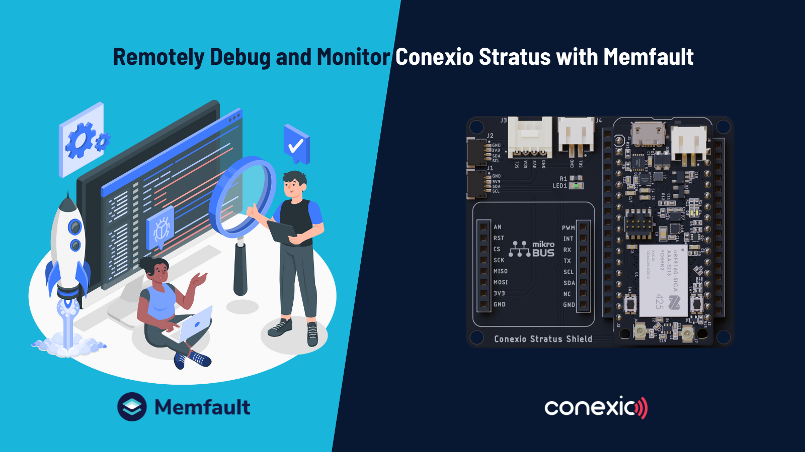

<div align="center">

[](https://twitter.com/conexiotech)
[](https://developer.nordicsemi.com/nRF_Connect_SDK/doc/latest/)
[](LICENSE)
[](https://www.nordicsemi.com/Products/nRF9151)


# Conexio Firmware SDK

Sample applications, board definitions, and developer resources for the
**Conexio Stratus Pro** — a compact, production-ready cellular IoT development
kit built on the Nordic nRF9151 SiP.

**40+ samples** covering RTOS, peripherals, sensors, cellular, cloud, and power management.

</div>

---

## 🚀 Getting Started

**1. Install the environment**  
Follow the [Conexio Documentation](https://docs.conexiotech.com/) to install nRF Connect SDK v2.9.0 and set up the build toolchain.

**2. Clone this SDK**
```bash
git clone https://github.com/Conexiotechnologies/conexio-firmware-sdk.git \
    /opt/nordic/ncs/v2.9.0/conexio-firmware-sdk
```

**3. Build a sample**
```bash
west build -b conexio_stratus_pro/nrf9151/ns \
    samples/conexio_stratus/<sample_folder> \
    -- -DBOARD_ROOT=/opt/nordic/ncs/v2.9.0/conexio-firmware-sdk
```

**4. Flash to the device**
```bash
newtmgr -c serial image upload \
    build/<project_name>/zephyr/zephyr.signed.bin
```

> Not sure which `<project_name>` to use? Each sample's `README` and `CMakeLists.txt` has it. See also the [Sample Index](samples/conexio_stratus/SAMPLE_INDEX.md).

---

## 🔧 Hardware

| | Feature | Details |
|-|---------|---------|
| 📶 | SoC | Nordic nRF9151 (also nRF9161 variant) |
| 🌐 | Connectivity | LTE-M / NB-IoT / GNSS |
| ⚡ | PMIC | Nordic nPM1300 |
| 📐 | Sensors | ST LIS2DH accelerometer (onboard) |
| 💾 | Storage | Microchip 24CW160 I2C EEPROM (2 KiB) |
| 🔋 | Power | LiPo battery with USB-C charging |
| 🔗 | Expansion | Qwiic / I2C connector, 28-pin edge header |

---

## 📦 Samples

All samples are in [`samples/conexio_stratus/`](samples/conexio_stratus/).  
See the **[Sample Index](samples/conexio_stratus/SAMPLE_INDEX.md)** for the full reference grouped by topic.

### 🧵 RTOS Foundations
| Sample | What it covers |
|--------|----------------|
| [`rtos_threads`](samples/conexio_stratus/rtos_threads/) | Threads, message queues, mutexes, semaphores |
| [`work_queue`](samples/conexio_stratus/work_queue/) | System/custom work queues, ISR→workqueue pattern |
| [`timers`](samples/conexio_stratus/timers/) | One-shot, periodic, stop-callback timers |

> 📖 See [RTOS_FOUNDATIONS.md](samples/conexio_stratus/RTOS_FOUNDATIONS.md) for a deep-dive guide with decision tables and code snippets.

### 🛠 Developer Tooling
| Sample | What it covers |
|--------|----------------|
| [`shell_commands`](samples/conexio_stratus/shell_commands/) | Interactive shell with nested subcommands |
| [`logging_levels`](samples/conexio_stratus/logging_levels/) | Log levels, runtime filtering, hexdump |
| [`nvs_storage`](samples/conexio_stratus/nvs_storage/) | Non-volatile key-value storage |

### ⚙️ Hardware Peripherals
| Sample | What it covers |
|--------|----------------|
| [`adc_read`](samples/conexio_stratus/adc_read/) | ADC sampling, oversampling, mV conversion |
| [`watchdog`](samples/conexio_stratus/watchdog/) | WDT setup, feeding, last-gasp callback |
| [`rtc_alarm`](samples/conexio_stratus/rtc_alarm/) | RTC counter alarm, wake from system-off |
| [`i2c_read_write`](samples/conexio_stratus/i2c_read_write/) | Direct I2C read/write API |
| [`spi_read_write`](samples/conexio_stratus/spi_read_write/) | Direct SPI transceive API, loopback test |
| [`ext_flash`](samples/conexio_stratus/ext_flash/) | I2C EEPROM read/write |
| [`pwm`](samples/conexio_stratus/pwm/) | PWM duty cycle control |

### 🔌 GPIO & Buttons
| Sample | What it covers |
|--------|----------------|
| [`led_blink`](samples/conexio_stratus/led_blink/) | GPIO output, LED toggle |
| [`button`](samples/conexio_stratus/button/) | GPIO interrupt, button-driven LED |
| [`digital_read_write`](samples/conexio_stratus/digital_read_write/) | Input + output on header pins |

### 🌡 Sensors
| Sample | What it covers |
|--------|----------------|
| [`accelerometer`](samples/conexio_stratus/accelerometer/) | LIS2DH via Zephyr sensor API |
| [`bme280`](samples/conexio_stratus/bme280/) | BME280 temperature, pressure, humidity |
| [`bme680`](samples/conexio_stratus/bme680/) | BME680 environmental sensor |
| [`dps310`](samples/conexio_stratus/dps310/) | DPS310 barometric pressure |
| [`sht3xd`](samples/conexio_stratus/sht3xd/) | SHT3x humidity and temperature |
| [`sht4x`](samples/conexio_stratus/sht4x/) | SHT4x humidity and temperature |
| [`sht4x_power_gate`](samples/conexio_stratus/sht4x_power_gate/) | SHT4x with GPIO power gating |
| [`multi_sensor`](samples/conexio_stratus/multi_sensor/) | LIS2DH + SHT4x combined |
| [`battery_adc`](samples/conexio_stratus/battery_adc/) | Battery voltage measurement |

### 🔋 PMIC
| Sample | What it covers |
|--------|----------------|
| [`npm1300_fuel_gauge`](samples/conexio_stratus/npm1300_fuel_gauge/) | nPM1300 SoC, TTE/TTF, SoC bar indicator |
| [`npm_leds`](samples/conexio_stratus/npm_leds/) | nPM1300 LED driver, host mode control |

### 📡 Cellular & Cloud
| Sample | What it covers |
|--------|----------------|
| [`cellular_test`](samples/conexio_stratus/cellular_test/) | AT command connectivity test suite |
| [`at_client`](samples/conexio_stratus/at_client/) | Transparent AT proxy over UART |
| [`udp`](samples/conexio_stratus/udp/) | UDP socket, PSM, eDRX, RAI |
| [`mqtt_control`](samples/conexio_stratus/mqtt_control/) | MQTT publish/subscribe, LED control |
| [`datacake`](samples/conexio_stratus/datacake/) | Datacake cloud integration |
| [`gnss`](samples/conexio_stratus/gnss/) | GNSS fix, NMEA output |
| [`wifi_scan`](samples/conexio_stratus/wifi_scan/) | Wi-Fi scan, SSID/RSSI reporting |
| [`golioth_samples`](samples/conexio_stratus/golioth_samples/) | Golioth cloud (hello + stream) |
| [`cellular_modem_battery_monitor`](samples/conexio_stratus/cellular_modem_battery_monitor/) | Cellular + battery combined |

### 💤 Power & System
| Sample | What it covers |
|--------|----------------|
| [`low_power_mode`](samples/conexio_stratus/low_power_mode/) | System-off, ~8.9 µA idle, PPK2 measurement |
| [`device_info`](samples/conexio_stratus/device_info/) | IMEI, modem FW version, RSRP |
| [`full_modem_firmware_update`](samples/conexio_stratus/full_modem_firmware_update/) | Full modem DFU via SMP/UART |
| [`empty_template`](samples/conexio_stratus/empty_template/) | Bare-bones starting point |

---

## 🎓 Featured Tutorials

<table>
    <tr>
        <td align="center">
            <br/>
            <b>Getting Started with nRF Connect for VS Code</b><br/>
            <a href="https://www.rajeevpiyare.com/posts/nrfconnect-vs-code/">Blog</a> ·
            <a href="https://www.hackster.io/piyareraj/getting-started-with-nrf-connect-for-visual-studio-code-24c882">Hackster</a> ·
            <a href="samples/conexio_stratus/led_blink/">Source</a>
        </td>
        <td align="center">
            <br/>
            <b>Connecting Stratus Pro to Datacake</b><br/>
            <a href="https://www.rajeevpiyare.com/posts/stratus-to-datacake/">Blog</a> ·
            <a href="https://www.hackster.io/piyareraj/how-to-connect-and-visualize-iot-data-using-datacake-cloud-2f6681">Hackster</a> ·
            <a href="samples/conexio_stratus/datacake/">Source</a>
        </td>
        <td align="center">
            <br/>
            <b>Connecting Stratus Pro to Golioth</b><br/>
            <a href="https://www.rajeevpiyare.com/posts/stratus-to-golioth/">Blog</a> ·
            <a href="https://www.hackster.io/piyareraj/connecting-conexio-stratus-to-golioth-platform-e15cd9">Hackster</a> ·
            <a href="samples/conexio_stratus/golioth_samples/">Source</a>
        </td>
    </tr>
    <tr>
        <td align="center">
            <br/>
            <b>Machine Learning with Edge Impulse</b><br/>
            <a href="https://www.rajeevpiyare.com/posts/edge-impulse/">Blog</a> ·
            <a href="https://www.hackster.io/piyareraj/machine-learning-with-conexio-stratus-and-edge-impulse-25ad20">Hackster</a>
        </td>
        <td align="center">
            <br/>
            <b>Device Debugging with Memfault</b><br/>
            <a href="https://www.rajeevpiyare.com/posts/stratus-to-memfault/">Blog</a> ·
            <a href="https://www.hackster.io/piyareraj/remote-device-debugging-and-monitoring-using-memfault-093aee">Hackster</a>
        </td>
        <td align="center">
            <br/>
            <b>Up and Running with Zephyr RTOS</b><br/>
            <a href="https://www.rajeevpiyare.com/posts/stratus-getting-started/">Blog</a> ·
            <a href="https://www.hackster.io/piyareraj/up-and-running-with-zephyrrtos-on-conexio-stratus-iot-kit-4661a3">Hackster</a>
        </td>
    </tr>
</table>

---

## 🗂 Repository Structure

```
conexio-firmware-sdk/
├── boards/conexio/stratus_pro/   ← board definitions (DTS, Kconfig, pinctrl)
├── samples/conexio_stratus/      ← all sample applications
│   ├── SAMPLE_INDEX.md           ← complete sample reference by topic
│   └── RTOS_FOUNDATIONS.md       ← deep-dive RTOS guide
├── CHANGELOG.md                  ← version history
├── CONTRIBUTING.md               ← guidelines for adding samples
└── README.md                     ← this file
```

---

## ✅ Feature Status

| Feature | Status |
|---------|:------:|
| 🔌 GPIO / LED / Button | ✅ |
| 〰️ PWM | ✅ |
| 📊 ADC / Battery monitoring | ✅ |
| 🔗 I2C direct API | ✅ |
| 🔗 SPI direct API | ✅ |
| 💾 I2C EEPROM (24CW160) | ✅ |
| 🗄 NVS non-volatile storage | ✅ |
| 📐 LIS2DH accelerometer | ✅ |
| 🌡 SHT4x / SHT3x humidity & temperature | ✅ |
| 🌡 BME280 / BME680 environmental sensor | ✅ |
| 🌡 DPS310 pressure & temperature | ✅ |
| 🔋 nPM1300 fuel gauge + SoC bar indicator | ✅ |
| 💡 nPM1300 LED control | ✅ |
| 🐕 Watchdog timer | ✅ |
| ⏰ RTC alarm + wake from system-off | ✅ |
| 🧵 RTOS threads, work queues, timers | ✅ |
| 🐚 Shell commands | ✅ |
| 📋 Logging levels & runtime filtering | ✅ |
| 📟 AT client | ✅ |
| 📶 Cellular connectivity test | ✅ |
| 📶 UDP + PSM / eDRX / RAI | ✅ |
| ☁️ MQTT publish / subscribe | ✅ |
| ☁️ Datacake cloud | ✅ |
| ☁️ Golioth cloud | ✅ |
| 🛰 GNSS | ✅ |
| 📡 Wi-Fi scan | ✅ |
| 💤 Low power mode (~8.9 µA) | ✅ |
| 🔄 Full modem firmware update | ✅ |
| 👁 UsefulSensors Person Sensor | ✅ |
| 🔐 TCP client | ⏳ |
| 🔐 TLS / HTTPS | ⏳ |
| 📍 Cellular-based location | ⏳ |
| 📦 Asset tracking | ⏳ |

> ✅ Ready to use &nbsp;·&nbsp; ⏳ In progress / planned

---

## 🔗 Related Projects

Companion repositories that extend the Stratus Pro platform with advanced use cases.

| Project | Description |
|---------|-------------|
| [🔋 Batteryless Cellular IoT with Conexio Stratus nRF9151](https://github.com/Conexiotechnologies/nrf9151-batteryless-cellular-iot) | Demonstrates energy-harvesting and batteryless operation on the nRF9151 — sample code, power budget analysis, and hardware setup for running cellular IoT applications without a battery |
| [📻 Getting Started with DECT NR+ on nRF9151](https://github.com/Conexiotechnologies/conexio_dect_nr) | Introduces DECT NR+ (the nRF9151's short-range wireless protocol) with step-by-step samples for device-to-device communication, ranging, and coexistence with LTE-M/NB-IoT |

---

## 💬 Community

| | |
|-|-|
| 💬 | [GitHub Discussions](https://github.com/Conexiotechnologies/conexio-firmware-sdk/discussions) — questions, ideas, show & tell |
| 🎮 | [Discord](https://discord.gg/2CZJTrt6Z5) — real-time chat with the community |
| 🐛 | [GitHub Issues](https://github.com/Conexiotechnologies/conexio-firmware-sdk/issues) — bug reports and feature requests |
| 📧 | [info@conexiotech.com](mailto:info@conexiotech.com) — direct contact |

---

## 🤝 Contributing

See [CONTRIBUTING.md](CONTRIBUTING.md) for guidelines on adding new samples,
naming conventions, required files, overlay patterns, and README structure.

---

## 📄 License

Apache 2.0 — see the [LICENSE](LICENSE) file for details.

The Apache 2.0 license allows you to freely use, modify, distribute, and sell
products that include this software. See
[choosealicense.com/licenses/apache-2.0](https://choosealicense.com/licenses/apache-2.0/)
for a plain-language summary.
