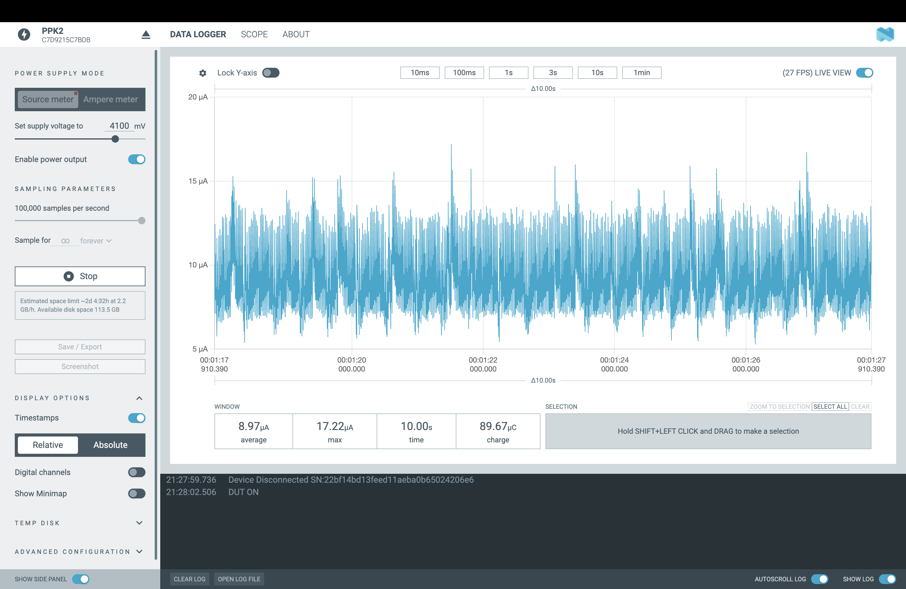

# Low Power Mode

The low power mode sample application demonstrates how to put the Stratus Pro in the active low power mode and measure the device current consumption using the Nordic's Power Profiler Kit II.

This application also demonstrates the low power hardware design of the entire cellular kit while constantly powered by the nPM1300 PMIC, without having to shut nPM1300 down or put it into shipment mode.

Some of the main firmware components that allows to put the nRF91 into low power state is:
- disabling the serial and logs in the `prj.conf`

```
CONFIG_SERIAL=n
CONFIG_LOG=n
```

- disabling the UART receiver in the platform device tree.

```
 &uart0 {
	status = "okay";
	/delete-property/ rx-pin;
};
```

## Building and running

See the [Conexio documentation](https://docs.conexiotech.com/) on how to build and flash the firmware to the device.

## Testing

After programming the sample to your device, test it by performing the following steps:
1. Connect the Stratus Pro device to the Power Profiler Kit II (PPK2) and set up for current measurement.
2. Install the Power Profiler app in the nRF Connect for Desktop app.
3. Connect the Power Profiler Kit II (PPK2) to the PC using a micro-USB cable and connect to it using the Power Profiler app.
4. Power on the device by enabling power output on the PPK2 with supply voltage set between 3700 mV to 4100mV.
5. Observe that after a few seconds the average power consumption will settle at around 8.9 uA.


## Stratus Pro Power Measurement using PPK2


